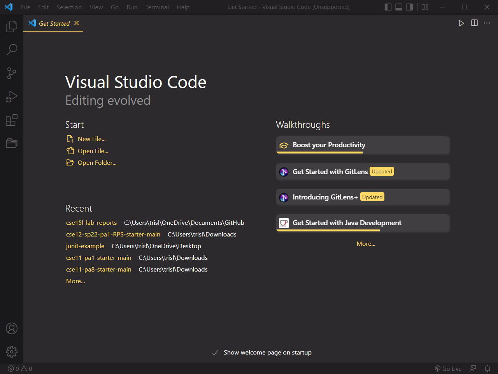
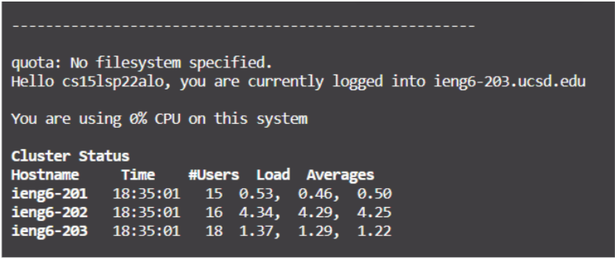
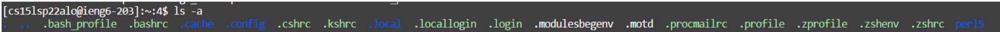
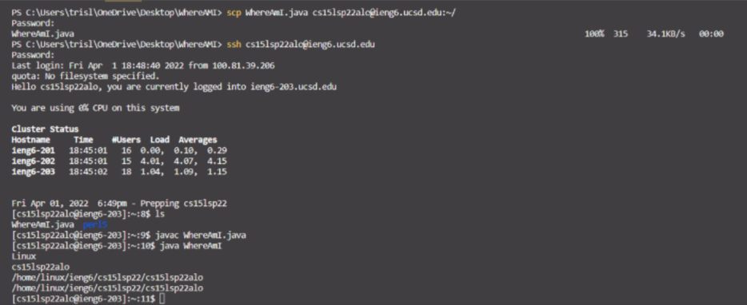
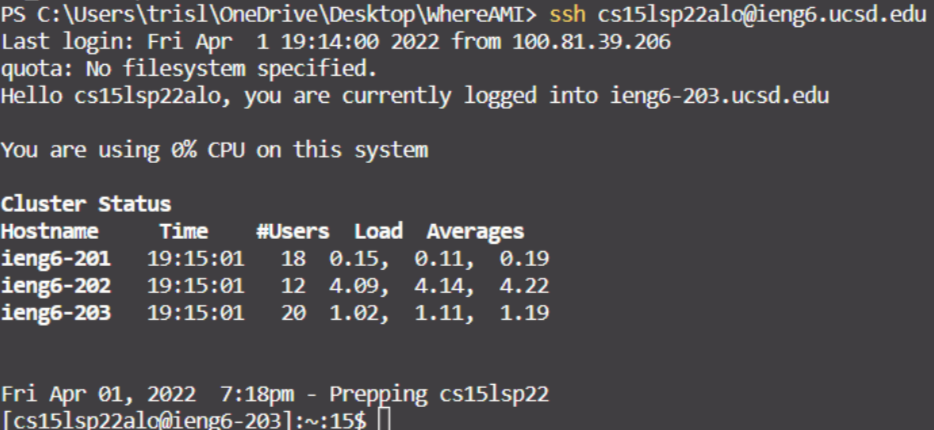
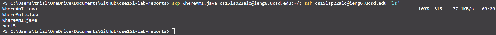

# Lab report 1

## Installing VScode

### [VScode](https://code.visualstudio.com/)

- Click the link to the vscode website
- Click the download button
- Follow the instructions.

  
A screenshot of visual studio code (vscode) starting page

---

## Remotely Connecting

- Install [Openssh](https://docs.microsoft.com/en-us/windows-server/administration/openssh/openssh_install_firstuse)
- Look up your [course-specific account](https://sdacs.ucsd.edu/~icc/index.php) for CSE 15L
- Connect using a terminal
- 1. Open a terminal in VScode by clicking **Terminal** and then **New Terminal**
- 2. Type the command: ```ssh cs15lsp22zz@ieng6.ucsd.edu``` with _zz_ replaced by the letters your course-specific account; if a text prompts out, saying "Are you sure you want to continue connecting (yes/no/[fingerprint])?" Then type yes.
- 3. Type in your password


The terminal prompt when succesfully logged into remote server.

---

## Trying some commands

- After established remote connection, try the following commands:
- 1. ```cd```
- 2. ```ls -lat```
- 3. ```ls -a```
- 4. ```cp /home/linux/ieng6/cs15lsp22/public/hello.txt ~/```
- Then, also try it on local computer after logging out the remote connection


The ls -a command will list all the files (including the hidden files).

---

## Moving Files with -scp command

- Create a java file named WhereAmI.java on your local folder and copy and paster the following contents in:

```java
class WhereAmI {
    public static void main(String[] args) {
        System.out.println(System.getProperty("os.name"));
        System.out.println(System.getProperty("user.name"));
        System.out.println(System.getProperty("user.home"));
        System.out.println(System.getProperty("user.dir"));
    }
}
```

- Use the command: ```scp WhereAmI.java cs15lsp22zz@ieng6.ucsd.edu:~/``` (With _zz_ replaced with the letters of your username)
- When prompted to login, enter the password again
- Now it should be sent to the ieng6 computer. Login using ssh and use ls command to check.


After typing scp and ssh commands, what the terminal looks like.

---

## Setting an SSH key

### ssh-keygen allows you to create a pair of public key and private key in place of your password, so you do not need to type in password everytime when you try to establish a remote connection

- In terminal, type ```ssh-keygen```
- If using windows system, then type ```ssh-keygen -t ed25519```
- Press enter twice (to make sure no passphrase is added)
- Copy the public key to the remote computer
- 1. log in using ssh
- 2. type ```.mkdir ssh```
- 3. log out
- 4. type ```scp /Users/user-name/.ssh/id_rsa.pub cs15lsp22zz@ieng6.ucsd.edu:~/.ssh/authorized_keys```; Replace user-name, id_rsa.pub, and zz with your own username and path


After setting the ssh key, the user no longer needs to enter passcode to log in to remote server.

---

## Optimize Remote Running

- you can write a command inside quotes at the end of an ssh command
- format: ```ssh cs15lsp22zz@ieng6.ucsd.edu "ls"```

- you can use semicolons to process multiple tasks with one line  
- format: ```cp WhereAmI.java OtherMain.java; javac OtherMain.java; java WhereAmI```

- you can also use up-arrow to recall the last command

### Example

I can edit the file locally and upload it to the remote computer with one single line:

```java
scp WhereAmI.java cs15lsp22alo@ieng6.ucsd.edu:~/; ssh cs15lsp22alo@ieng6.ucsd.edu "ls"
```

And it will give me the following output:

By typing multiple commands in one line, it shortens the time to do certain things with less keystrokes.
