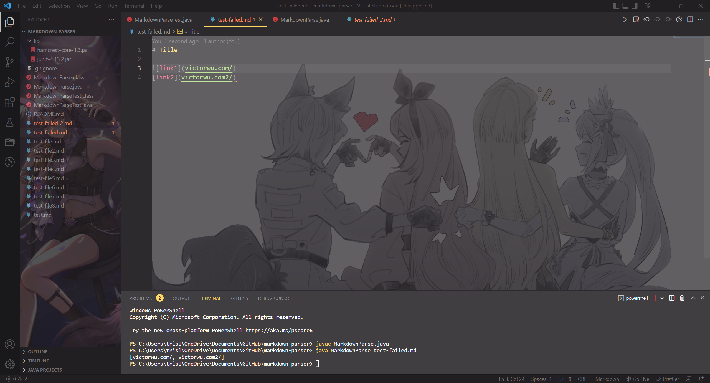

# Lab report 2

## Image bug

### [Failed Test Link (test with an image link)](https://github.com/vjwuUCSD/markdown-parser/blob/main/my%20test%20files/test2-file.md)

When the test file above was run with the original code, the image link will also be included in the list (The first link). SYmptom: extra output. The symptom was produced because the program will read all the characters that are between open and closed parenthesis. The bug was that the code did not ignore the image link, which has a very similar format with a link in md language. THe failure-inducing input includes an image link, and thus the symtom occurs.

---

## Infinite loop bug

