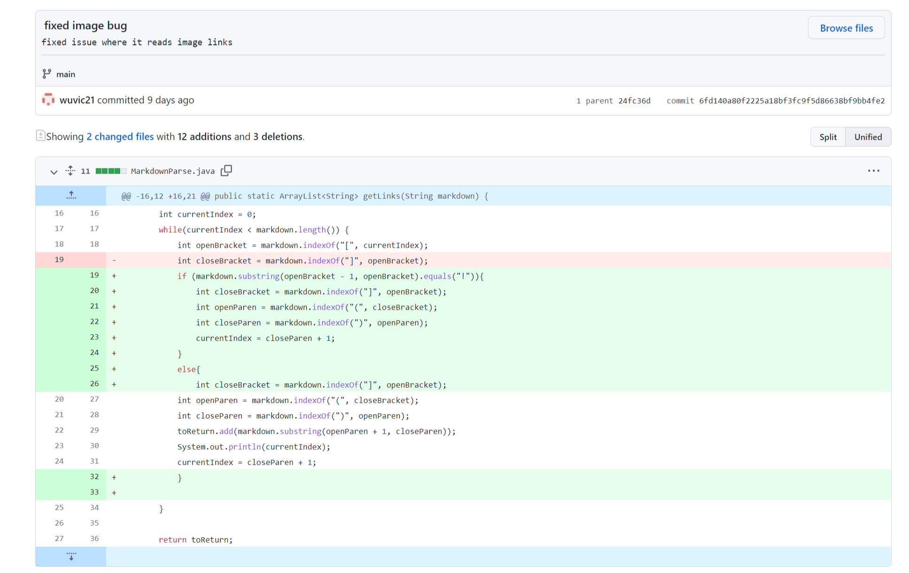
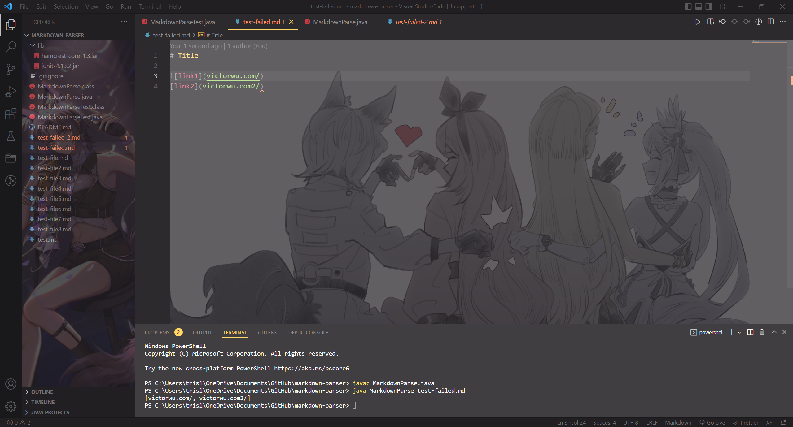
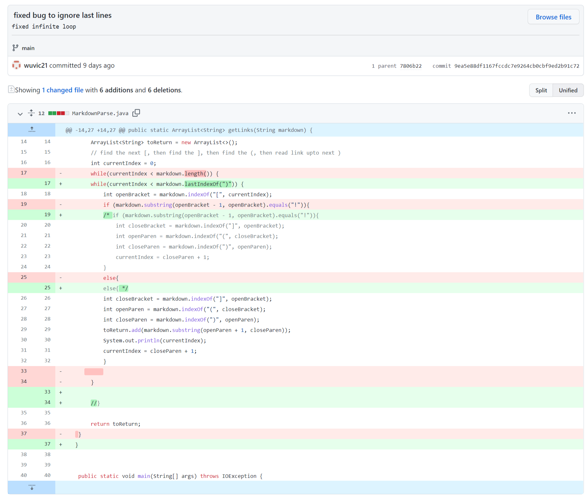
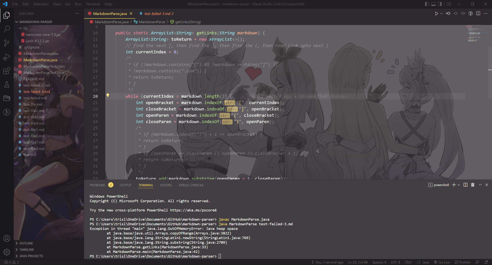
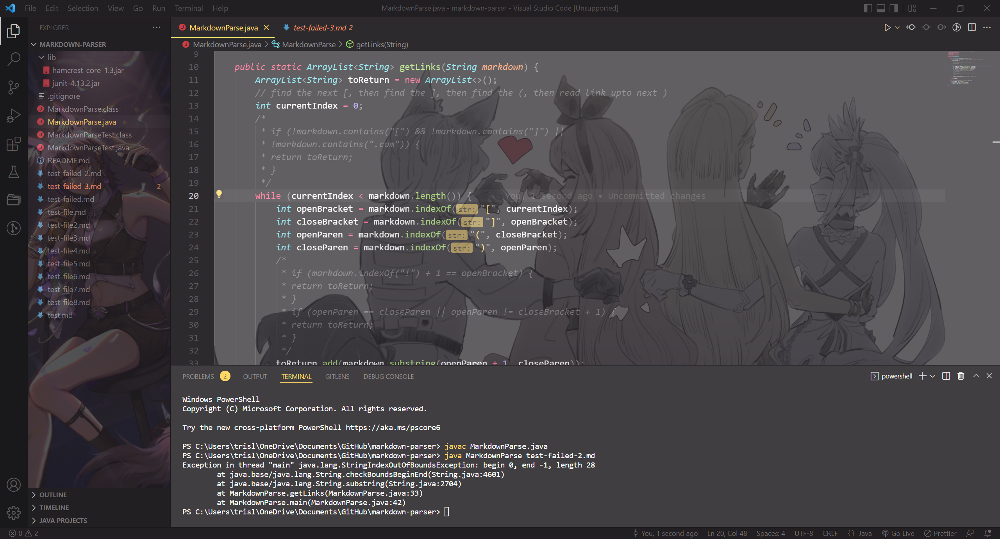

# Lab report 2

## Image bug

### [Failed Test Link (test with an image link)](https://github.com/vjwuUCSD/markdown-parser/blob/main/my%20test%20files/test2-file.md)

When the test file above was run with the original code, the image link will also be included in the list (The first link). Symptom: extra output. The symptom was produced because the program will read all the characters that are between open and closed parenthesis. The bug was that the code did not ignore the image link, which has a very similar format with a link in md language. The failure-inducing input includes an image link, and thus the symtom occurs.

---

## Infinite loop bug

### [Failed Test Link](https://github.com/vjwuUCSD/markdown-parser/blob/main/my%20test%20files/test3-file.md)

When the test file above was run with the original code, the code wouldn't compile and a java OutOfMemoryError exception was thrown. Symptom: program crashed. The symptom was produced as a result of an infinite while loop that will run forever. The bug was that the code will continue to run the loop after the last closed parenthesis was read. The failure-inducing input has some text following the last link, causing the symptom.

---

## File with no link bug

### [Failed Test link](https://github.com/swang0222/markdown-parser/blob/main/test-failed-2.md)

When the test file above was run with the original code, an IndexOutOfBound exception was thrown. Symptom: program crashed. Bug: the indices of openParen and closeParen were not updated as program run. The symptom occurred as the program tried to read the characters between the indices of openParen and closeParen. The failure-inducing input does not have a link (thus does not have a pair of parentheses), causing the bug to run and symptom to occur.
