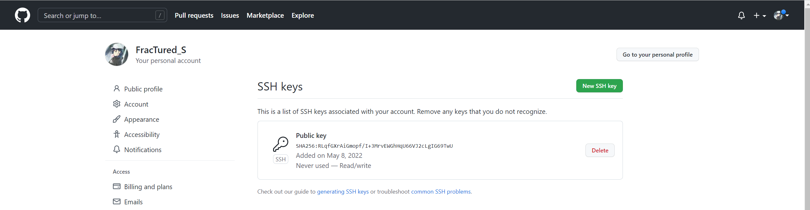

# Lab Report 3

## SSH Configuration

### .ssh/config file

It is located in the Users

### File editor

I used sublime text to edit the file

### Simplified ssh login

### scp command

---

## Setup Github Access

### Public key in Github

### Public & Private key in Users

### Git push

### [Link to the commit](https://github.com/swang0222/markdown-parser/commit/7b8fb0312e9203a17c9cc63caac585a2421cdc48)

---

## Copy whole directory

### Copied the entire directory with scp -r

### Running tests on ieng6

### Combine all commands in one line

