# Lab Report 4

## Links

- [My markdown-parser repo](https://github.com/swang0222/markdown-parser)
- [The reviewed markdown-parse](https://github.com/Jiaying6429/markdown-parser)

---

## Snippet 1

### Snippet 1 preview

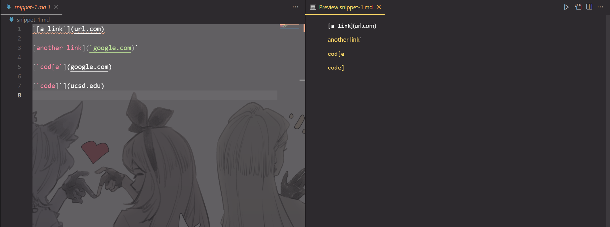

### Junit tests for snippet 1

- Test case with my own MarkdownParse.java
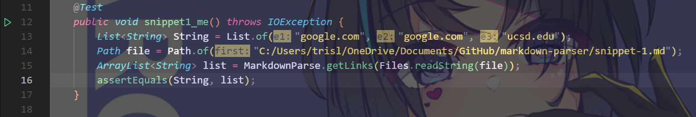
- Test case with reviewed MarkdownParse.java
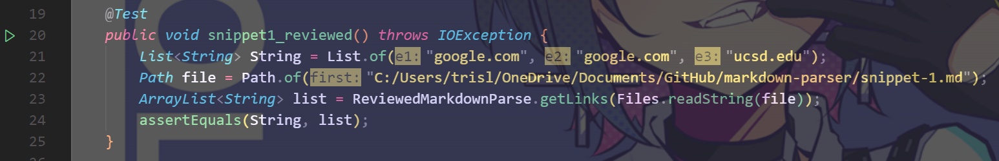

### My MarkdownParse test output for snippet 1

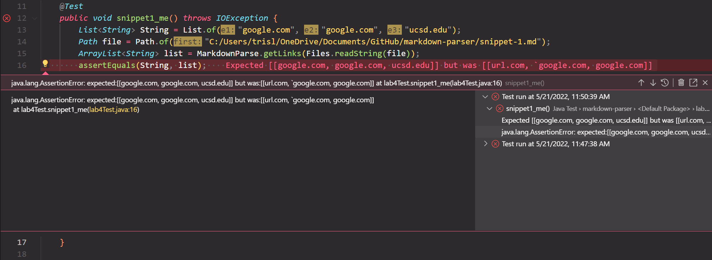  

### Reviewed MarkdownParse test output for snippet 1

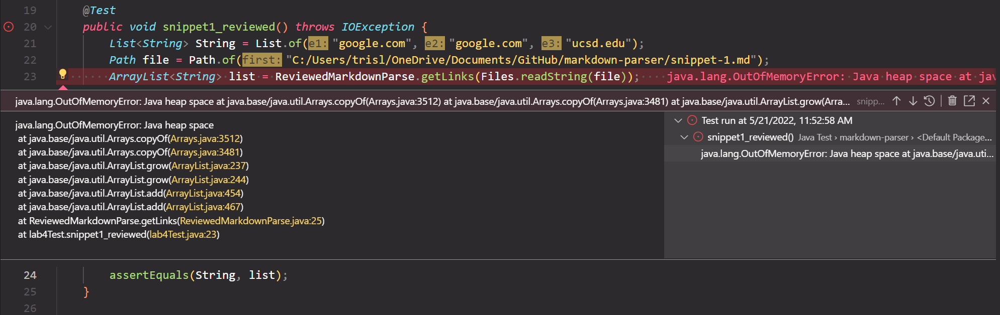

---

## Snippet 2

### Snippet 2 preview

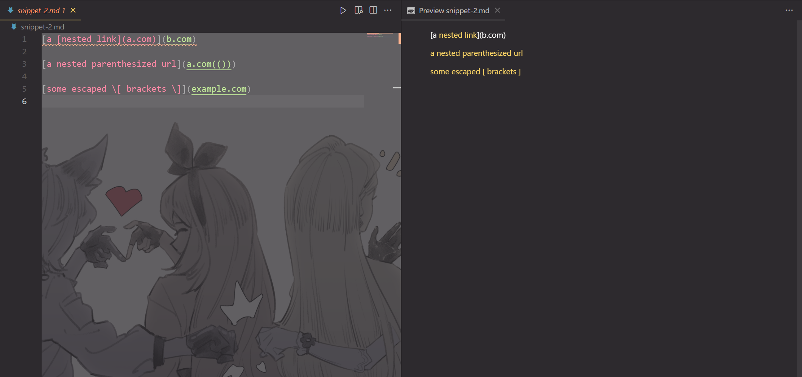

### Junit tests for snippet 2

- Test case with my own MarkdownParse.java
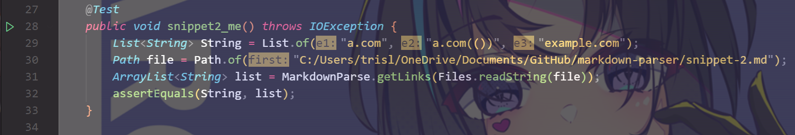
- Test case with reviewed MarkdownParse.java
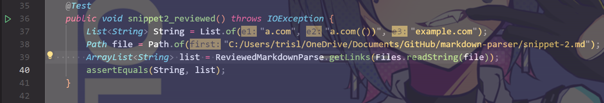

### My MarkdownParse test output for snippet 2

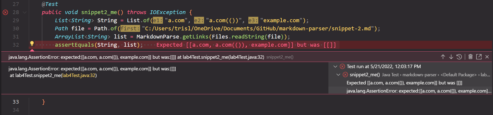  

### Reviewed MarkdownParse test output for snippet 2

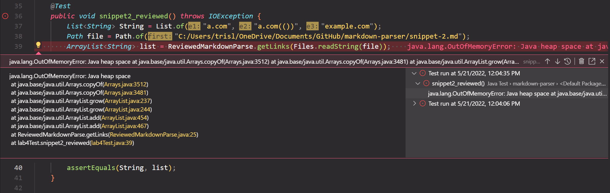

---

## Snippet 3

### Snippet 3 preview

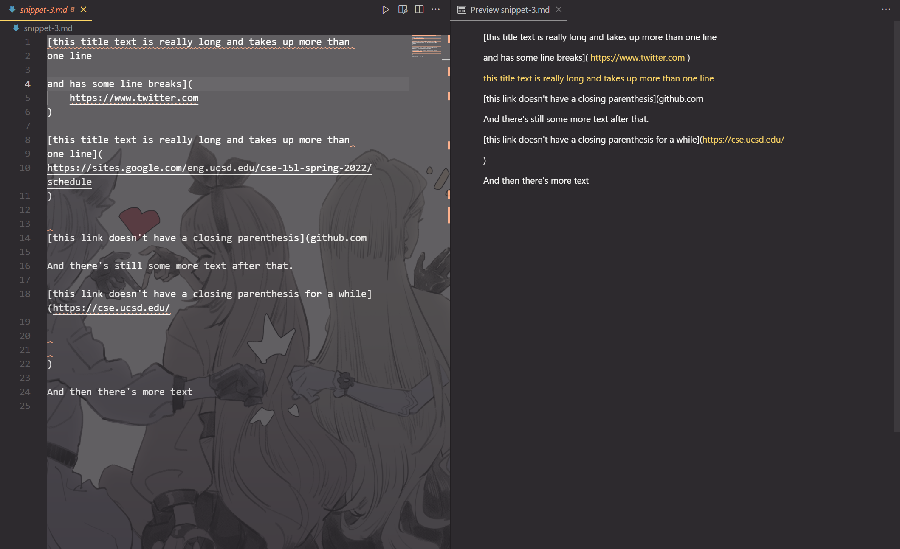

### Junit tests for snippet 3

- Test case with my own MarkdownParse.java
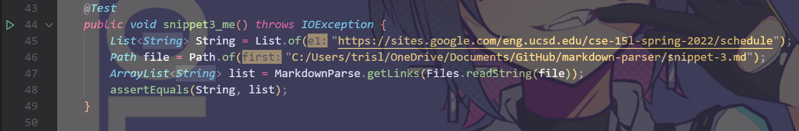
- Test case with reviewed MarkdownParse.java
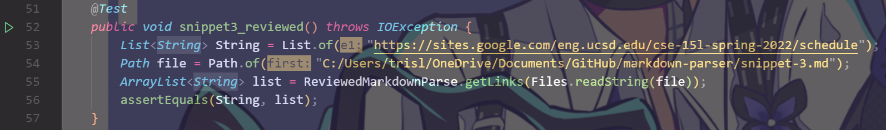

### My MarkdownParse test output for snippet 3

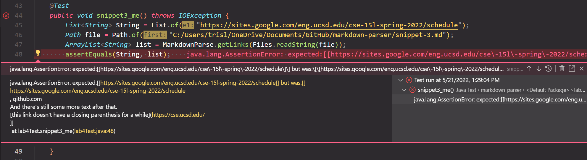  

### Reviewed MarkdownParse test output for snippet 3

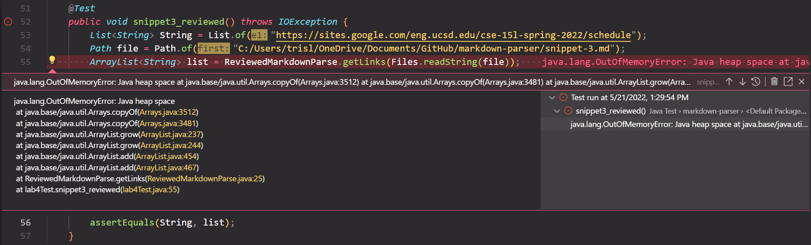

---

## **Code fixing**

### Code changes related to snippet 1

- I made the following changes in my code and now test case 1 passed
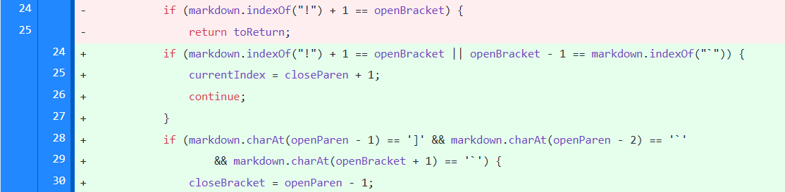
- Passed test 1
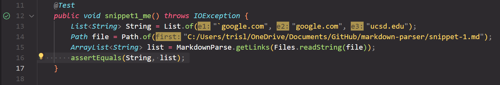

- I basically asked the program to check whether there's inline backticks inside the brackets; if so, then ignore the contents between the backticks and just focus on the contents after the open parenthesis.

---

### Code changes related to snippet 2

- This needs a more involved change, as the current code only expects a set of only one openParen, closeParen, openBracket and closeBracket in one line, and to make the program work for snippet 2, I need to reconstruct the method so that it counts the number of openParen, closeParen, openBracket and closeBracket in one line.

---

### Code changes related to snippet 3

- I made the following changes in my code and the test case 3 is very close to pass

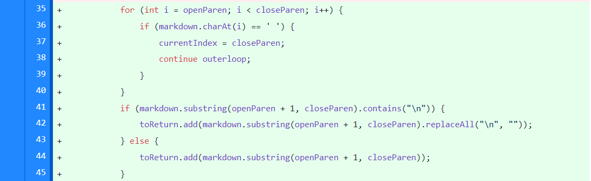
- Close to pass
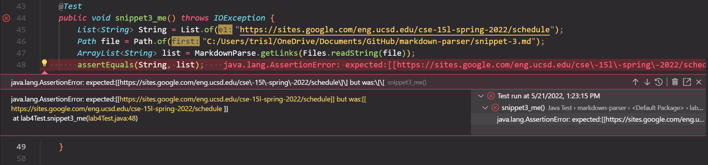

- I do not know where goes wrong here, but it seems like there only need a little more change and the test case will pass. In my code, I asked program to check whether there is a new line or space character between the parenthesis; if there's a whitespace, jump to the next link, and if there's new line, delete the new line characters.
