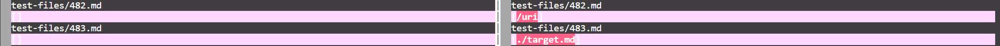
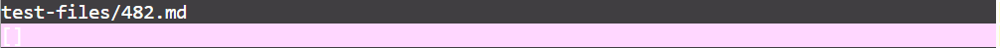
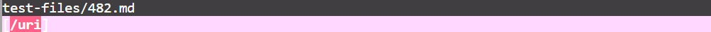
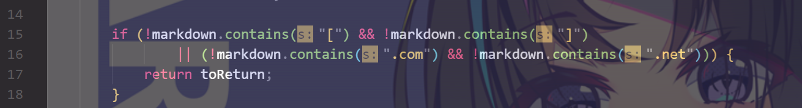
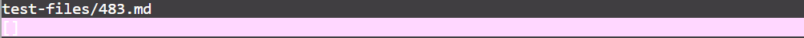
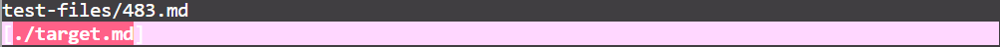

# Lab Report 5

## Different tests

I use vimdiff to check the two results files and find test files 482 and 483 produce different answers



### [link to test file 482](https://github.com/nidhidhamnani/markdown-parser/blob/main/test-files/482.md)

### [link to test file 483](https://github.com/nidhidhamnani/markdown-parser/blob/main/test-files/483.md)

---

## Test file 482

### Expected output : [/uri]


### Actual output of my implementation for test file 482



### Actual output of provided implementation for test file 482



Based on vscode preview, I assume that the provided implementation gives the correct answer, as the provided implementation does have a link included whereas my implementation does not

### My code that needs to be fixed



Basically, the program is only reading the link with .com or .net, so I need to delete the statement after ```||``` to fix it

---

## Test file 483

### Expected output : []


### Actual output of my implementation for test file 483



### Actual output of provided implementation for test file 483



Based on vscode preview, I assume that my implementation gives the correct answer, as my implementation does not produce anything whereas the provided implementation does produce a link

### Provided code that needs to be fixed


The provided implementation fails to check if there's some words inside the brackets, so all it needs to do is to add a statement to check if the two brackets are next to each other
